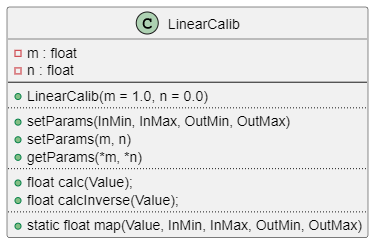

# LinearCalib

A library for providing a floating point based calibration class

## General

The library does not have any dependencies to other libraries. Neither `malloc` nor `new` is used, therefore it can be used in an environment where 
dynamic memory allocation is not available (e.g. safety critical environment). 

## Features

* Implemented as C++ class with common Arduino style guide
* setter and getter for calibration parameters `m` and `n` 
* Calculation of calibration parameters based on two calibration points
* static function compatible to Arduino `map` function
* Low memory consumption overhead

## Integration

Here the integration of the calibration class is shown with a simple Arduino Sketch:

* include the library

  ```C++
  #include <Arduino.h>
  #include <linearcalib.h>
  ```

* create an instance of the class

  ```C++
  LinearCalib myCalib;
  ```

## Usage

* setup with already known calibration factors:

  ```C++
  float m=2.0;
  float n=1.0;
  myCalib.setParams(m, n);
  ```

* setup my calculating the calibration factors:

  ```C++
  float InMin=1.056;   // for excample a messured raw value where 0 is expected
  float InMax=79.93;   // for excample a messured raw value where 80 is expected
  float OutMin=0.0;    // expected value
  float OutMax=80.0;   // expected value
  myCalib.setParams(InMin, InMax, OutMin, OutMax);
  ```

* read data a sensor (for example) and let the calibration class do its work:

  ```C++
  int val = analogRead(A0); 
  float calibratedVal = myCalib.calc(val);
  ```


## API

### Setup

* *Constructor*: `LinearCalib(const float f32_m = 1.0, const float f32_n = 0.0);`

  The constructor sets the initial parameters `m` and `n`. 

* `void setParams(const float f32_m, const float f32_n);`

  Sets the calibration parameters `m` and `n`. 

* `int setParams(const float f32_InMin, const float f32_InMax, const float f32_OutMin, const float f32_OutMax);`

  Calculates and sets the calibration parameters used for calculation.

  :warning: When calibrating to messured values, use the raw values from the sensor. Do not used already calibrated values.

* `void getParams(float *pf32_m, float *pf32_n);`

  Returns the calibration parameters.

### Operation

* `float calc(const float f32_Value);`

  Calculates a calibrated value from a raw (sensor) value. This method uses the function `f(x) = m*x + n`.

* `float calcInverse(const float f32_Value);`

  Calculates a value using the inverse calibration function. This method uses the function `f-1(x) = (x-n)/m`. 

* `static float map(const float f32_Value, const float f32_InMin, const float f32_InMax, const float f32_OutMin, const float f32_OutMax);`

  This static method corresponds to the Arduino `map()` function, but uses floating point arithmetic instead. It does *not* use the parameters `m` and `n`. 

## Diagrams

### Class Diagram

This diagram illustrates only the LinearCalib class. There are no other classes or important structures within this library.



### Sequence Diagram

This sequence diagram illustrates the initialization and the very basic usage. 


## Limitations
                                               
* The library works with floating point arithmetic, therefore there are limitaions according to the precision of the datatype `float`.

* The library only supports two calibration points with linear calibration. 


## Known Anomalies

* none


## Changelog

### 1.1.0

* Inverse calculation added


### 1.0.0

* Initial release


## Website

Further information can be found on [GitHub](https://github.com/steftri/linearcalib).

